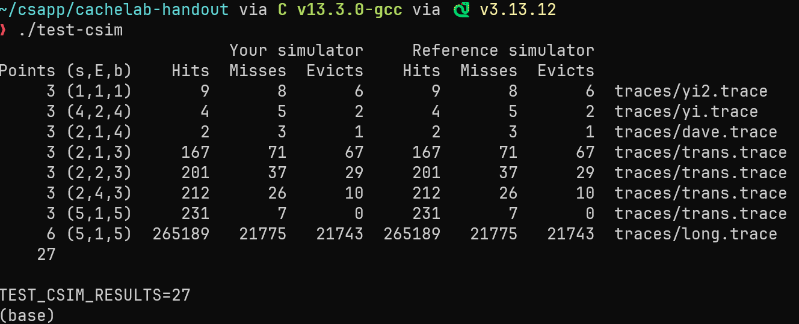
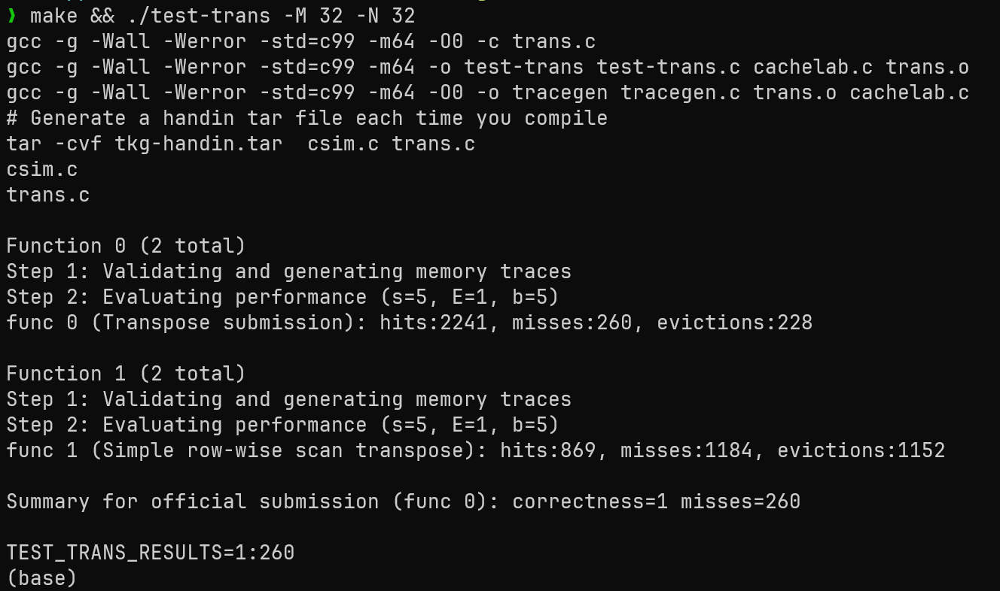
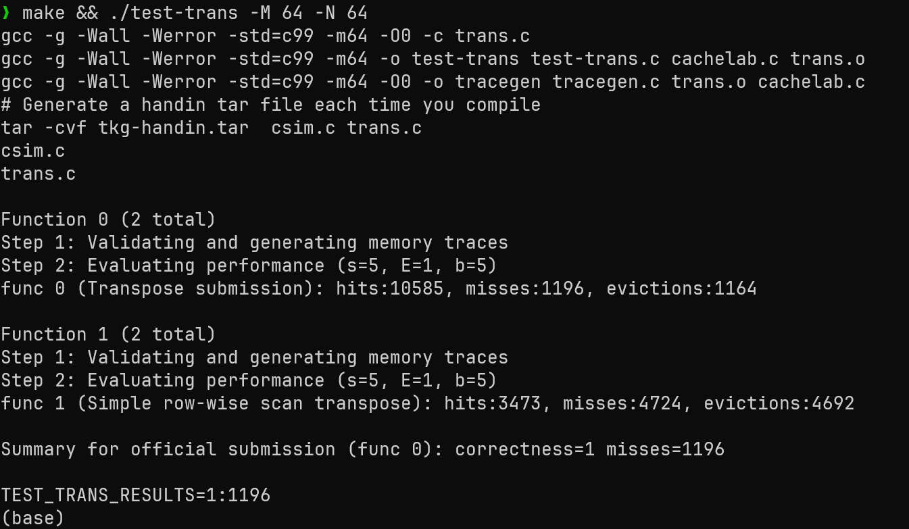
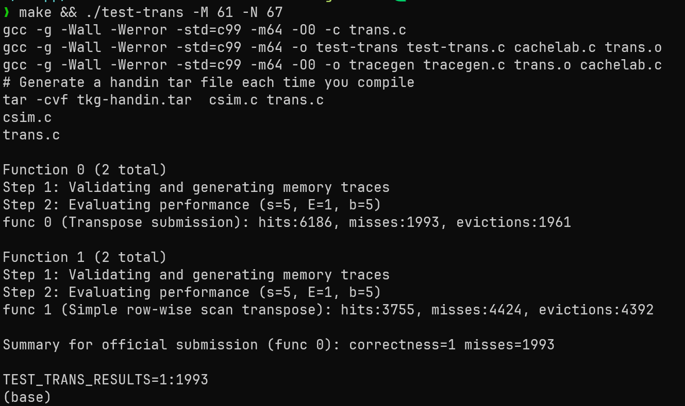

# cachelab实验报告

陈彦杰 10255101442

## 模拟内存管理

本题较易，只要注意cache中内存储存的细节就行。

我们先来回忆一下cache中内存中的储存模式：


代码实现如下：

```c
typedef struct {
    int valid;
    unsigned long long tag; //address is 64 bits
    int lru_timestamp; 
    //block在本题中没有意义，不用存
} cache_line;

void init_cache() {
    S = 1 << s; // 2^s
    cache = (cache_line **)malloc(S * sizeof(cache_line *)); //控制组号的指针
    for (int i = 0; i < S; i++) {
        cache[i] = (cache_line *)calloc(E, sizeof(cache_line));
        // calloc will set all memory to zero
    }
}
```


为了读写一个特定地址，我们需要知道两个值：`tag`和`set index`。有了这两个值之后，我们只需遍历对应的set中的cache line，找到包含对应的tag的cache line即可。

那么我们该怎么知道这两个值呢？对于一个64位的地址和一组输入的s,E,b，我们只需取地址的最后的b位作为block offset，然后取剩下的地址的最后s位作为set index，剩下的值就是tag了。

```c
int set_index = (address >> b) & (1<<s - 1);
unsigned long long tag = address >> (b + s);
```

有两个地方需要注意：

- 本题中不需要真的去读写数据，只用统计hit,miss,eviction的数量，所以block offset是没有意义的
- 为什么tag使用long long而set_index使用int呢？因为只有在s>32的情况下set_index才超出int的范围，但是此时一个set的内存就已经超过256G，这是不可能的。反过来说，大多数时候tag都超过32位，同时我们希望它进行逻辑右移，所以采用unsigned long long


接下来是具体读写内存的过程。因为对于冲突的情况采用LRU的策略，所以我们使用一个lru_clock的变量来作为时间戳，这个值越大代表这个cacheline在越近的时刻被访问过，每次遇到冲突的时候就踢出lru_clock最小的cacheline。

每次搜索对应的set，若找到对应tag的cache_line则说明hit，若没有找到但是该set里面有空位则是miss，需要找到一个空位来存放数据。若连空位都没有则是eviction，需要驱逐lru_clock最小的cache_line来存放数据。

具体代码如下：

```c
void access_cache(unsigned long long address) {
    //提取地址中的set index和tag
    int set_index = (address >> b) & ((1 << s) - 1);
    unsigned long long tag = address >> (s + b);

    cache_line *set = cache[set_index];

    //check if hit
    for (int i = 0; i < E; i++) {
        // hit
        if (set[i].valid && set[i].tag == tag) {
            hits++;
            lru_clock++;
            set[i].lru_timestamp = lru_clock;
            return;
        }
    }
    //miss
    misses++;
    for (int i = 0; i < E; i++){
        if (!set[i].valid) {
            set[i].valid = 1;
            set[i].tag = tag;
            lru_clock++;
            set[i].lru_timestamp = lru_clock;
            return;
        }
    }
    //eviction
    evictions++;
    int min_index = 0;
    int min_timestamp = set[0].lru_timestamp;
    for (int i = 1; i < E; i++) {
        if (set[i].lru_timestamp < min_timestamp) {
            min_timestamp = set[i].lru_timestamp;
            min_index = i;
        }
    }
    set[min_index].tag = tag;
    lru_clock++;
    set[min_index].lru_timestamp = lru_clock;
    
}

```

下面是完整代码：

```c
#include "cachelab.h"
#include <getopt.h> //用于方便的读取参数
#include <stdlib.h>
#include <stdio.h>

int s, E, b; // parameters of cache
int S; // S = 2^s
int hits = 0, misses = 0, evictions = 0;
int lru_clock = 0; // timestamp of the last access;larger number indicates more recent use

// structure of one line

typedef struct {
    int valid;
    unsigned long long tag; //address is 64 bits
    int lru_timestamp;
} cache_line;

cache_line **cache; // cache[set][line]

typedef struct {
    int valid;
    unsigned long long tag; //address is 64 bits
    int lru_timestamp;
} cache_line;
void init_cache() {
    S = 1 << s; // 2^s
    cache = (cache_line **)malloc(S * sizeof(cache_line *)); //控制组号的指针
    for (int i = 0; i < S; i++) {
        cache[i] = (cache_line *)calloc(E, sizeof(cache_line));
        // calloc will set all memory to zero
    }
}

void free_cache() {
    for (int i = 0; i < S; i++) {
        free(cache[i]);
    }
    free(cache); // 别忘了free管理set的指针
}

void access_cache(unsigned long long address) {
    //提取地址中的set index和tag
    int set_index = (address >> b) & ((1 << s) - 1);
    unsigned long long tag = address >> (s + b);
	// 取出对应的set
    cache_line *set = cache[set_index];

    //check if hit
    for (int i = 0; i < E; i++) {
        // hit
        if (set[i].valid && set[i].tag == tag) {
            hits++;
            lru_clock++;
            set[i].lru_timestamp = lru_clock;
            return;
        }
    }
    //miss
    misses++;
    // 找个空位放
    for (int i = 0; i < E; i++){
        if (!set[i].valid) {
            set[i].valid = 1;
            set[i].tag = tag;
            lru_clock++;
            set[i].lru_timestamp = lru_clock;
            return;
        }
    }
    //eviction
    evictions++;
    int min_index = 0;
    int min_timestamp = set[0].lru_timestamp;
    // 寻找最久没有被访问过的cache_line
    for (int i = 1; i < E; i++) {
        if (set[i].lru_timestamp < min_timestamp) {
            min_timestamp = set[i].lru_timestamp;
            min_index = i;
        }
    }
    set[min_index].tag = tag;
    lru_clock++;
    set[min_index].lru_timestamp = lru_clock;
    
}

void read_trace(char *trace_file) {
    // 文件指针
    FILE *fp = fopen(trace_file, "r");
    if (!fp) {
        printf("Error: Cannot open %s\n", trace_file);
        exit(1);
    }

    char op;
    unsigned long long address;
    int size;
    char line[256];
    while(fgets(line, sizeof(line), fp)) {
        // 指令加载的行忽略
        if (line[0] == 'I') {
            continue;
        }
        // %c前面加空格来忽略输入中的空格，地址要用llx来读取输入，因为只有long long是所有系统上都是64位的
        if(sscanf(line, " %c %llx,%d", &op, &address, &size) == 3) {
            if (op == 'L' || op == 'S') {
                // load和save操作只用访问一次缓存
                access_cache(address);
            }
            else{
                // modify操作需要访问两次缓存，读取一次，改写后写回一次
                access_cache(address);
                access_cache(address);
            }
        }
    }
    fclose(fp);
}
int main(int argc, char *argv[])
{
    char *trace_file = NULL;
    int opt;
    // “s:E:b:t的意思是读取s,E,b,t中的一个参数符号并返回，同时读取这个参量后面的以斜杠开头的参数并存进optarg里面
    while((opt = getopt(argc, argv, "s:E:b:t:")) != -1) {
        switch (opt) {
            case 's':
                s = atoi(optarg);
                break;
            case 'E':
                E = atoi(optarg);
                break;
            case 'b':
                b = atoi(optarg);
                break;
            case 't':
                trace_file = optarg;
                break;
            default:
                printf("something went wrong.\n");
                exit(1);
        }
    }

    init_cache();
    read_trace(trace_file);
    printSummary(hits, misses, evictions);
    free_cache();
    return 0;
}

```

测试结果如下：



# 矩阵转置的优化

缓存参数：`s = 5, E = 1, b = 5`。

所以这是一个有 32 个组（S=32）的直接映射高速缓存（E=1），每个组只有 1 个块，每个块有 32 个字节（B=32）。

也就是说，一共可以放得下 1024 个字节，即 256 个 int。

## 32 x 32

目标：misses <= 300

对于32 * 32的矩阵，一行对应4个cache line，所以cache中总共可以放下矩阵中的连续8行而不冲突。同时，这也说明任何相隔行数是8的倍数的位置同时存进cache都会导致冲突。

我们先来看看看朴素的转置算法的问题所在：

```c
for (int i = 0; i < M; i++) {
    for (int j = 0; j < N; j++){
        B[j][i] = A[i][j];
    }
}
```

A的读取部分是cache友好的，每次读取一个数字将会把8个数字存进缓存，也就是说读取部分只会产生32 * 32 / 8 = 128次miss

但是B的写入部分就非常灾难了。因为每次循环要遍历写入32行的第i列，远远超出cache的上限8行，所以实际上每次写入都是miss，一共有32 * 32 = 1024次miss

所以应该是1024 + 128 = 1152次miss……吗？

经过实验发现，实际的miss是1184次，还有32次miss在哪里呢？

这就是**对角线冲突**。考虑i = 0, j = 0的情况，我们先读了`A[0][0]`，把`A[0][0-7`]放进缓存，随后又访问了`B[0][0]`,但是注意`A[0][0]`和`B[0][0]`正好相隔1024个int，也就是32行，是8的倍数！所以写入B的时候会把A给驱逐，导致读取`A[0][1]`的时候有多出了一次miss，这就是所谓的对角线冲突。

但是为什么这种冲突只会发生在对角线元素呢？证明如下：

对于行优先储存的矩阵：

```
A[i][j]` 的地址 = `base_A + (i×32 + j) × 4
B[j][i]` 的地址 = `base_B + (j×32 + i) × 4
```

set index 是地址右移 `b=5` 位后取低 `s=5` 位，也就是取地址的第 5～9 位。等价于 `(地址 / 32) % 32`。

所以：

`A[i][j]` 的 set index =  `(base_A/32 + i×4 + j/8) % 32`

`B[j][i]` 的 set index = `(base_B/32 + j×4 + i/8) % 32`

冲突条件是两者set index相等：

```
(base_A/32 + i×4 + j/8) ≡ (base_B/32 + j×4 + i/8)  (mod 32)
```

整理得：

```
(i×4 + j/8) - (j×4 + i/8) ≡ (base_B - base_A)/32  (mod 32)
```

考虑矩阵是32 * 32的，base_B - base_A是32的倍数，所以：

```
i×4 + j/8 ≡ j×4 + i/8  (mod 32)
```

即：

```
4(i - j) ≡ (i - j)/8  (mod 32)
```

这说明：

```
(i - j) × 31 ≡ 0  (mod 256)
```

但是31与256互质，所以i - j是256的倍数。

但是对于32 * 32的矩阵，|i - j| ≤ 31，所以唯一的解就是i = j

即只有对角线会发生对角线冲突，证毕。


接下来我们来考虑怎么优化程序。

首先我们要利用局部性，所以我们采用矩阵分块的策略。这样，对于一个小矩阵，只要把每一行都读过一次，这个矩阵中剩下的元素就全部在cache中了，可以大大减少写入时候的miss。

那么怎么选择矩阵分块的大小呢？显然分块不能太大，不然分块的矩阵内部又会产生冲突。选择8 * 8作为分块矩阵似乎是一个合理的选择，因为cache中正好能放下8行矩阵，8*8矩阵恰好不会发生冲突。

其次我们来解决对角线冲突的问题。既然写入时会导致读取的数据丢失，那我们就先用临时变量把读取的行给储存起来，这样即使被驱逐了也还能使用里面的数据。

代码如下：

```c
    if (M == 32 && N == 32) {
        for (i = 0; i < N;i += 8) {
            for (j = 0; j < M; j += 8) {
                for (k = i; k < i + 8; k++) {
                    if (i == j) {
                        t0 = A[k][j];
                        t1 = A[k][j + 1];
                        t2 = A[k][j + 2];
                        t3 = A[k][j + 3];
                        t4 = A[k][j + 4];
                        t5 = A[k][j + 5];
                        t6 = A[k][j + 6];
                        t7 = A[k][j + 7];
                        B[j][k] = t0;
                        B[j + 1][k] = t1;
                        B[j + 2][k] = t2;
                        B[j + 3][k] = t3;
                        B[j + 4][k] = t4;
                        B[j + 5][k] = t5;
                        B[j + 6][k] = t6;
                        B[j + 7][k] = t7;
                    }
                    else {
                        B[j][k] = A[k][j];
                        B[j + 1][k] = A[k][j + 1];
                        B[j + 2][k] = A[k][j + 2];
                        B[j + 3][k] = A[k][j + 3];
                        B[j + 4][k] = A[k][j + 4];
                        B[j + 5][k] = A[k][j + 5];
                        B[j + 6][k] = A[k][j + 6];
                        B[j + 7][k] = A[k][j + 7];

                    }
                }
            }
        }

```

但是这样还是会产生288次miss，原因在于读入`A[k][i]`的时候，把`B[i]`给驱逐了，这样写入`B[i]`的时候又会产生一个miss，一来一回就产生了两次miss。有什么办法能省去这两次miss吗？

我们想到可以先把分块中所有行复制到B中（不转置），然后再在B中转置，这样只有一开始的读取8次miss+写入8次miss，后面B中转置全部是hit，每个对角块只有16次miss，已经和非对角块一样了。

代码如下：

```c
    if (M == 32 && N == 32) {
        for (i = 0; i < N;i += 8) {
            for (j = 0; j < M; j += 8) {
                // 对角块
                if (i == j) {
                    // 先原样复制
                    for (k = i; k < i + 8; k++) {
                        t0 = A[k][j];
                        t1 = A[k][j + 1];
                        t2 = A[k][j + 2];
                        t3 = A[k][j + 3];
                        t4 = A[k][j + 4];
                        t5 = A[k][j + 5];
                        t6 = A[k][j + 6];
                        t7 = A[k][j + 7];
                        B[k][j]     = t0;
                        B[k][j + 1] = t1;
                        B[k][j + 2] = t2;
                        B[k][j + 3] = t3;
                        B[k][j + 4] = t4;
                        B[k][j + 5] = t5;
                        B[k][j + 6] = t6;
                        B[k][j + 7] = t7;
                    }
                    // 再在B中做转置
                    for (k = 0; k < 8; k++) {
                        for(l = 0; l < k; l++) {
                            t0 = B[i + k][j + l];
                            B[i + k][j + l] = B[j + l][i + k];
                            B[j + l][i + k] = t0;
                        }
                    }
                }
                // 非对角块，正常复制即可
                else {
                    for (k = i; k < i + 8; k++) {
                        t0 = A[k][j];
                        t1 = A[k][j+1];
                        t2 = A[k][j+2];
                        t3 = A[k][j+3];
                        t4 = A[k][j+4];
                        t5 = A[k][j+5];
                        t6 = A[k][j+6];
                        t7 = A[k][j+7];
                        B[j][k]   = t0;
                        B[j+1][k] = t1;
                        B[j+2][k] = t2;
                        B[j+3][k] = t3;
                        B[j+4][k] = t4;
                        B[j+5][k] = t5;
                        B[j+6][k] = t6;
                        B[j+7][k] = t7;
                    }
                }
            }
        }
    }

```

经过测试，这样的miss数为260次，比理论下界多出的4次为函数调用所致。

测试截图：



## 64 * 64

在这题中，我们不能继续采用8*8的分块策略了，因为此时矩阵一行就要占8个int，每4行矩阵就会导致一次冲突，8 * 8矩阵内部就会产生冲突。而采用4*4的策略则只使用了一半的缓存，仍然无法通过。

最优的策略是基于8 * 8分块，然后再在分块的内部进行4 * 4的分块，具体思路如下图：


第一步：先读A中的前4行，没有冲突。但是此时不能把两块都放到正确的位置，否则会导致跨越8行导致冲突。所以这里先把右上角的块转置后暂存在B的右上角。

第二步：读取A的左下角和B的右上角，然后把A的左下角放到B的右上角（正确位置），再把B的右上角放到B的左下角（正确位置）。因为此时B的右上角已经存储完成，所以冲突也无所谓。

第三步：将A的右下角正常写入B的右下角即可。这里采用32*32中的方法，先复制再转置。

我们来计算一下这种方法会造成多少次的miss。对于非对角块，第一步中读取A中的4行需要4次miss，然后放进B中需要4次miss，每块8次，一共是512次。对于对角块，每块会有3次的额外冲突，8 * 3 = 24次。第二步中，对于非对角块依然是512次，对角块要多3次miss，3 * 8 = 24次，第三步中，非对角块完全没有miss，对角块有5次miss，一共40次。所以一共是1112次miss（实测1196次）

这个思路已经可以通过了，当然还可以通过在对角块的时候借用其他块来避免一些对角块时的miss，但是代码略显冗长，这里从略。

具体代码如下：

```c
    else if (M == 64 && N == 64) {
        for (i = 0; i < N; i += 8) {
            for (j = 0; j < M;j += 8) {
                for (k = i; k < i + 4; k++) {
                    // 复制A中前四行
                    t0 = A[k][j];
                    t1 = A[k][j + 1];
                    t2 = A[k][j + 2];
                    t3 = A[k][j + 3];
                    t4 = A[k][j + 4];
                    t5 = A[k][j + 5];
                    t6 = A[k][j + 6];
                    t7 = A[k][j + 7];
                    // 转置后放入B的左上角
                    B[j][k] = t0;
                    B[j + 1][k] = t1;
                    B[j + 2][k] = t2;
                    B[j + 3][k] = t3;
                    // 转置后暂存在B的右上角
                    B[j][k + 4] = t4;
                    B[j + 1][k + 4] = t5;
                    B[j + 2][k + 4] = t6;
                    B[j + 3][k + 4] = t7;
                }
                for (k = j; k < j + 4; k++) {
                    // 读取B的右上角和A的左下角
                    t0 = B[k][i + 4];
                    t1 = B[k][i + 5];
                    t2 = B[k][i + 6];
                    t3 = B[k][i + 7];
                    t4 = A[i + 4][k];
                    t5 = A[i + 5][k];
                    t6 = A[i + 6][k];
                    t7 = A[i + 7][k];
                    // 写入B的右上角
                    B[k][i + 4] = t4;
                    B[k][i + 5] = t5;
                    B[k][i + 6] = t6;
                    B[k][i + 7] = t7;
                    // 写入B的左下角
                    B[k + 4][i] = t0;
                    B[k + 4][i + 1] = t1;
                    B[k + 4][i + 2] = t2;
                    B[k + 4][i + 3] = t3;
                }
                // 先把A的右下角复制到B的右下角
                for (k = 4; k < 8; k++) {
                    t0 = A[i + k][j + 4];
                    t1 = A[i + k][j + 5];
                    t2 = A[i + k][j + 6];
                    t3 = A[i + k][j + 7];
                    B[j + k][i + 4] = t0;
                    B[j + k][i + 5] = t1;
                    B[j + k][i + 6] = t2;
                    B[j + k][i + 7] = t3;
                }
                // 然后再转置
                for (k = 4; k < 8; k++) {
                    for(l = 4; l < k; l++) {
                        t0 = B[j + k][i + l];
                        B[j + k][i + l] = B[j + l][i + k]; 
                        B[j + l][i + k] = t0;
                    }

            }
        }
    }

```

测试截图：



## 61 * 67

由于本题条件太过宽松，居然直接用16*16的分块就能过：

```c
    else {
        for (i = 0; i < N; i += 16) {
            for (j = 0; j < M;j += 16) {
                for(k = i; k < i + 16 && k < N; k++) {
                    for(l = j; l < j + 16 && l < M;l++) {
                        B[l][k] = A[k][l];
                    }
                }
            }
        }
    }
```

miss数为1993

测试截图：



神奇的是，8*8的分块居然过不了，原因可能是非规则矩阵对较小的分块不是很友好，但是8 * 8矩阵加上边角用4 * 4矩阵填充就能过。

完整代码如下（有注释版在上面）：

```c
void transpose_submit(int M, int N, int A[N][M], int B[M][N])
{
    int i, j, k, l;
    int t0, t1, t2, t3, t4, t5, t6, t7;
    if (M == 32 && N == 32) {
        for (i = 0; i < N;i += 8) {
            for (j = 0; j < M; j += 8) {
                if (i == j) {
                    for (k = i; k < i + 8; k++) {
                        t0 = A[k][j];
                        t1 = A[k][j + 1];
                        t2 = A[k][j + 2];
                        t3 = A[k][j + 3];
                        t4 = A[k][j + 4];
                        t5 = A[k][j + 5];
                        t6 = A[k][j + 6];
                        t7 = A[k][j + 7];
                        B[k][j]     = t0;
                        B[k][j + 1] = t1;
                        B[k][j + 2] = t2;
                        B[k][j + 3] = t3;
                        B[k][j + 4] = t4;
                        B[k][j + 5] = t5;
                        B[k][j + 6] = t6;
                        B[k][j + 7] = t7;
                    }
                    for (k = 0; k < 8; k++) {
                        for(l = 0; l < k; l++) {
                            t0 = B[i + k][j + l];
                            B[i + k][j + l] = B[j + l][i + k];
                            B[j + l][i + k] = t0;
                        }
                    }
                }
                else {
                    for (k = i; k < i + 8; k++) {
                        t0 = A[k][j];
                        t1 = A[k][j+1];
                        t2 = A[k][j+2];
                        t3 = A[k][j+3];
                        t4 = A[k][j+4];
                        t5 = A[k][j+5];
                        t6 = A[k][j+6];
                        t7 = A[k][j+7];
                        B[j][k]   = t0;
                        B[j+1][k] = t1;
                        B[j+2][k] = t2;
                        B[j+3][k] = t3;
                        B[j+4][k] = t4;
                        B[j+5][k] = t5;
                        B[j+6][k] = t6;
                        B[j+7][k] = t7;
                    }
                }
            }
        }
    }
    else if (M == 64 && N == 64) {
        for (i = 0; i < N; i += 8) {
            for (j = 0; j < M;j += 8) {
                for (k = i; k < i + 4; k++) {
                    t0 = A[k][j];
                    t1 = A[k][j + 1];
                    t2 = A[k][j + 2];
                    t3 = A[k][j + 3];
                    t4 = A[k][j + 4];
                    t5 = A[k][j + 5];
                    t6 = A[k][j + 6];
                    t7 = A[k][j + 7];
                    B[j][k] = t0;
                    B[j + 1][k] = t1;
                    B[j + 2][k] = t2;
                    B[j + 3][k] = t3;
                    B[j][k + 4] = t4;
                    B[j + 1][k + 4] = t5;
                    B[j + 2][k + 4] = t6;
                    B[j + 3][k + 4] = t7;
                }
                for (k = j; k < j + 4; k++) {
                    t0 = B[k][i + 4];
                    t1 = B[k][i + 5];
                    t2 = B[k][i + 6];
                    t3 = B[k][i + 7];
                    t4 = A[i + 4][k];
                    t5 = A[i + 5][k];
                    t6 = A[i + 6][k];
                    t7 = A[i + 7][k];
                    B[k][i + 4] = t4;
                    B[k][i + 5] = t5;
                    B[k][i + 6] = t6;
                    B[k][i + 7] = t7;
                    B[k + 4][i] = t0;
                    B[k + 4][i + 1] = t1;
                    B[k + 4][i + 2] = t2;
                    B[k + 4][i + 3] = t3;
                }
                for (k = 4; k < 8; k++) {
                    t0 = A[i + k][j + 4];
                    t1 = A[i + k][j + 5];
                    t2 = A[i + k][j + 6];
                    t3 = A[i + k][j + 7];
                    B[j + k][i + 4] = t0;
                    B[j + k][i + 5] = t1;
                    B[j + k][i + 6] = t2;
                    B[j + k][i + 7] = t3;
                }
                for (k = 4; k < 8; k++) {
                    for(l = 4; l < k; l++) {
                        t0 = B[j + k][i + l];
                        B[j + k][i + l] = B[j + l][i + k]; 
                        B[j + l][i + k] = t0;
                    }
                }
            }
        }
    }
    else {
       for (i = 0; i < N; i += 16) {
            for (j = 0; j < M;j += 16) {
                for(k = i; k < i + 16 && k < N; k++) {
                    for(l = j; l < j + 16 && l < M;l++) {
                        B[l][k] = A[k][l];
                    }
                }
            }
         
        }

    }
}

```


